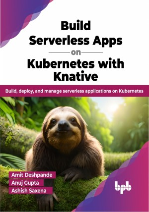

# Build Serverless Apps on Kubernetes with Knative

Learn how to deploy and maintain high-performing, resilient serverless applications using Knative

This is the repository for [Build Serverless Apps on Kubernetes with Knative
](https://bpbonline.com/products/build-serverless-apps-on-kubernetes-with-knative?variant=42866964168904),published by BPB Publications.

## About the Book
As cloud computing has become increasingly important in modern development workflows, developers have begun to look for ways to harness its full potential. Serverless architecture is one such approach, and Knative is a powerful and versatile solution for deploying and managing serverless containers.

This book is a comprehensive guide to Knative serverless containers. It begins by introducing the core concepts of serverless architecture and its benefits. Then, it provides an in-depth exploration of Knative, its components, and how it fits within the broader Kubernetes ecosystem. The book demonstrates how to build, deploy, and manage serverless containers using Knative through practical examples and case studies. It covers topics such as setting up a development environment, creating custom serverless applications, integrating with other cloud-native tools and services, and best practices for monitoring, logging, and troubleshooting. Toward the end, the book delves into advanced topics such as scaling, performance optimization, and security.

By the book's end, you can run serverless applications on Kubernetes using Knative.

## What You Will Learn
•  Get familiar with the core concepts of serverless architecture, the Knative project, and its components.

•  Learn how to set up a development environment for Knative.

•  Learn how to build and deploy Knative Functions effortlessly.

•  Build enterprise-grade apps using Knative components such as Serving and Eventing.

•  Optimize the performance and scalability of your serverless applications.
